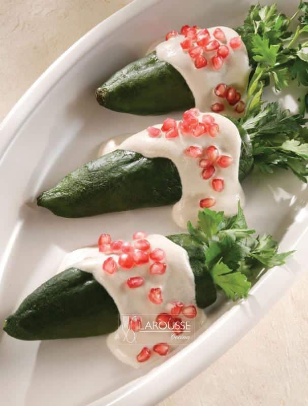
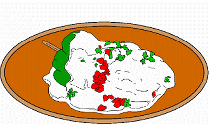

# Chiles en Nogada
## Ingredientes 👀

_**Para El Relleno**_
| Cantidad |Unidad de medida|Ingrediente|
| ----------- | ----------- | ----------- |
| 1  | cucharada | Caldo de costilla KNORR 
| 3  | cucharada | Aceite vegetal 
| 1/4| Un cuarto | Cebolla finamente picada
| 1  | Diente    | Ajo
|200 | Gramos    | Carne molida de res
|200 | Gramos    | Carne molida de cerdo
| 1  | pieza     | Manzana amarilla pelada y cortada en cubos
| 1  | pieza     | Pera de Anjou, cortada en cubos
| 1  | cucharada | Pasas 
| 1  | cucharada | Piñones blancos  o rosas 
| 1/2| cucaharada| Mezcla en partes iguales de pimienta negra, comino, canela, pimienta gorda y clavo en polvo
| 2  | cucharadas| Knorr Tomate Deshidratado
|1/2 | taza      | Agua 

_**Para la nogada**_
| Cantidad |Unidad de medida|Ingrediente|
| ----------- | ----------- | ----------- |
| 300| Gramos    | Nuez de castilla
| 1  | cucharada | Azúcar 
| 1  | Pizca     | Nuez Moscada en Polvo
| 1/4| Taza      | Crema Reducida en grasa

_**Para los chiles**_
| Cantidad |Unidad de medida|Ingrediente|
| ----------- | ----------- | ----------- |
| 8  | Piezas    | Chiles poblanos, sin piel y sin semillas
| 1  | Taza      | Granada Limpia 
| 1  | Pizca     | Nuez Moscada en Polvo
| 1  | Cucharada | perejil para decorar

<h3>PREPARACIÓN</h3>  
<ol>
<li> Para el relleno, calentar el aceite en una sartén grande, sofreír la cebolla y el ajo hasta que queden transparentes. Agregar la carne y cocinar hasta que tome color.</li>
<li>Agregar la manzana, pera, pasas, piñones y mezcla de condimentos. Sazonar con el Knorr® Caldo de Costilla incorporando todos los ingredientes <strong><em>  Cocinar 3 min. </em></strong> </li> 
<li>Mezclar Knorr® Tomate Deshidratado con el agua y combinarlo en la preparación anterior. Dejar que se integren todos los ingredientes y que se espese ligeramente.  <strong><em> Aprox 3 minutos más.</em></strong></li>
<li> Para la Nogada, licuar la nuez, azúcar, nuez moscada y crema. Si es necesario, agregar un poquito de leche descremada para obtener una consistencia más ligera.</li>
<li> Rellenar los chiles repartiendo uniformemente la carne en las <em><strong> 6 piezas. </strong></em> </li>
<li> Servir el chile bañado parcialmente con la nogada, esparcir la granada encima y decorar con las hojas de perejil.</li>
</ol>

<h4>PRESENTACIÓN</h4>
<ol>
<li>Coloque los chiles en un platón o en platos individuales. Báñelos con la nogada y decore con hojas de perejil, los granos de granada y las nueces. </em></strong> </li>
</ol>

_**Receta Casi Original del grupo de Chef_ATM**_
| Nombres|
| ----------- |
| Andres Belendez
| Rafael Garcia
| Mariana Meneses
| Jeannete Ramirez
| Ivan Pacheco
| Jeannete Ramirez
| Jonathan Velazquez
| César Vázquez

