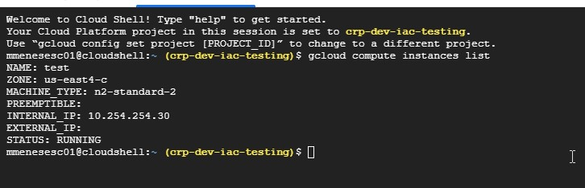

# grupo-02-Los_automatizados

## Comandos de gcloud para crear las siguientes consultas :technologist:

- [x] :memo:
### Listar Compute Engine  
> gcloud compute instances list  --> lista las instancias (VMs) dentro del proyecto configurado
git

https://cloud.google.com/sdk/gcloud/reference/compute/instances/list

<em><strong> * Ejemplo de ejecucion de comando  </strong></em>

<em><strong>:sparkles:   :heavy_minus_sign:    :heavy_minus_sign:    :heavy_minus_sign:    :heavy_minus_sign:    :heavy_minus_sign:    :heavy_minus_sign:    :heavy_minus_sign:    :heavy_minus_sign:    :heavy_minus_sign:    :heavy_minus_sign:    :heavy_minus_sign:     :heavy_minus_sign:     :heavy_minus_sign:    :heavy_minus_sign:    :heavy_minus_sign:     :heavy_minus_sign:    :heavy_minus_sign:    :heavy_minus_sign:    :heavy_minus_sign:    :heavy_minus_sign:    :heavy_minus_sign:    :heavy_minus_sign: :sparkles:</strong></em>

<em><strong>:sparkles:   :heavy_minus_sign:    :heavy_minus_sign:    :heavy_minus_sign:    :heavy_minus_sign:    :heavy_minus_sign:    :heavy_minus_sign:    :heavy_minus_sign:    :heavy_minus_sign:    :heavy_minus_sign:    :heavy_minus_sign:    :heavy_minus_sign:     :heavy_minus_sign:     :heavy_minus_sign:    :heavy_minus_sign:    :heavy_minus_sign:     :heavy_minus_sign:    :heavy_minus_sign:    :heavy_minus_sign:    :heavy_minus_sign:    :heavy_minus_sign:    :heavy_minus_sign:    :heavy_minus_sign: :sparkles:</strong></em>

<em><strong> * Como visualizar en la consola de gcp </strong></em>

<em><strong>:sparkles:   :heavy_minus_sign:    :heavy_minus_sign:    :heavy_minus_sign:    :heavy_minus_sign:    :heavy_minus_sign:    :heavy_minus_sign:    :heavy_minus_sign:    :heavy_minus_sign:    :heavy_minus_sign:    :heavy_minus_sign:    :heavy_minus_sign:     :heavy_minus_sign:     :heavy_minus_sign:    :heavy_minus_sign:    :heavy_minus_sign:     :heavy_minus_sign:    :heavy_minus_sign:    :heavy_minus_sign:    :heavy_minus_sign:    :heavy_minus_sign:    :heavy_minus_sign:    :heavy_minus_sign: :sparkles:</strong></em>

<em><strong>:sparkles:   :heavy_minus_sign:    :heavy_minus_sign:    :heavy_minus_sign:    :heavy_minus_sign:    :heavy_minus_sign:    :heavy_minus_sign:    :heavy_minus_sign:    :heavy_minus_sign:    :heavy_minus_sign:    :heavy_minus_sign:    :heavy_minus_sign:     :heavy_minus_sign:     :heavy_minus_sign:    :heavy_minus_sign:    :heavy_minus_sign:     :heavy_minus_sign:    :heavy_minus_sign:    :heavy_minus_sign:    :heavy_minus_sign:    :heavy_minus_sign:    :heavy_minus_sign:    :heavy_minus_sign: :sparkles:</strong></em>

<em><strong>:sparkles:   :heavy_minus_sign:    :heavy_minus_sign:    :heavy_minus_sign:    :heavy_minus_sign:    :heavy_minus_sign:    :heavy_minus_sign:    :heavy_minus_sign:    :heavy_minus_sign:    :heavy_minus_sign:    :heavy_minus_sign:    :heavy_minus_sign:     :heavy_minus_sign:     :heavy_minus_sign:    :heavy_minus_sign:    :heavy_minus_sign:     :heavy_minus_sign:    :heavy_minus_sign:    :heavy_minus_sign:    :heavy_minus_sign:    :heavy_minus_sign:    :heavy_minus_sign:    :heavy_minus_sign: :sparkles:</strong></em>

- [x] :memo:
### Listar IP’s en uso, existentes o reservadas
> gcloud compute addresses list

https://cloud.google.com/sdk/gcloud/reference/compute/addresses/list

- [x] :memo:
### Listar buckets disponibles
> gcloud alpha storage ls

> gsutil ls

https://cloud.google.com/storage/docs/listing-buckets#gsutil-list-buckets

- [x] :memo:
### Listar Service Accounts existentes en un proyecto
> gcloud iam service-accounts list

https://cloud.google.com/sdk/gcloud/reference/iam/service-accounts/list

- [x] :memo:
### Comando habilitar una API para un proyecto con la consola

> gcloud services enable pubsub.googleapis.com

https://cloud.google.com/apis/docs/getting-started?hl=es-419

Para mas informacion consulten a nuestro equipo Los_Automatizados :sparkles: